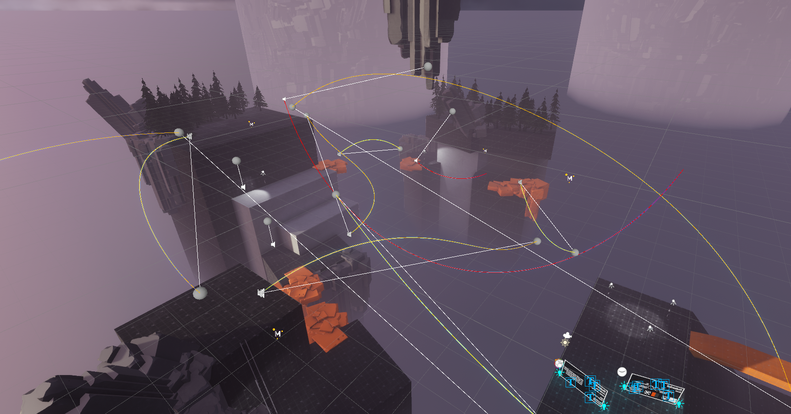

# Geegaz's Climbing System
A fun climbing system for VRChat, made with [UdonSharp](https://udonsharp.docs.vrchat.com/)



## Features

- Configurable climbing system
- Configurable jumping from climbed wall
- VR & Desktop compatible 
- **Original zipline system with editor tools**

### Limitations
- No stamina system
- Can only grab with one hand at a time

## Installation

Download the repository, then **unpack it in the Assets folder** of your Unity project.
You must have **UdonSharp** installed in your project for this package to work.

If you don't have UdonSharp installed, check out their documentation for the installation steps: https://udonsharp.docs.vrchat.com/setup

This package also comes with alternative materials for [Silent's Filamented shaders](https://gitlab.com/s-ilent/filamented) and [Orels1's ORL shaders](https://github.com/orels1/orels-Unity-Shaders)

## Prefabs

Name | Description | Path
---|---|---
**Climbing System** | Climbing system already set up and ready to use | [ ```/Climbing System```](./)
**Line** | Simple BoosterLine with a line renderer set up | [ ```/Elements/Line/Line```](./Elements/Line/)
**Booster** | Complete example of what's possible with the Booster | [ ```/Elements/Booster/Booster```](./Elements/Booster/)
**Pulley Handle** | Version of the Booster more adapted to BoosterLines of type `Simple` | [ ```/Elements/Handle/Pulley Handle```](./Elements/Handle/)
**Swing Handle** | Version of the Booster more adapted to BoosterLines of type `Swing` | [ ```/Elements/Handle/Swing Handle```](./Elements/Handle/)
**Booster Flame, Booster Impact, Booster Smoke** | Various particle effects used by the Booster prefab | [ ```/Models/Booster Ball/Effects/Booster Flame```](./Models/Booster%20Ball/Effects/)<br>[ ```/Models/Booster Ball/Effects/Booster Impact```](./Models/Booster%20Ball/Effects/)<br>[ ```/Models/Booster Ball/Effects/Booster Smoke```](./Models/Booster%20Ball/Effects/)

## How to Use

### Climbing

1. In your Project Settings, in the Tags & Layers tab, set the layer 23 to `Climbing`
2. Drag the Climbing System prefab in the scene
3. Set the layer of any collider you want to climb to `Climbing`
4. Ingame, **alternate between right/left click on desktop or right/left hand in VR to climb**

### Ziplines
1. Drag the Line prefab in the scene
2. Drag the Booster prefab on the Line (so that it's a child of the Line)
3. Drag the Climbing System from the scene in the corresponding field of the Booster
4. Select the Line and select its type between `Simple, Weighted, Curved or Swing`
5. Move the points of the line to give it the shape you want
6. If needed, increase the baked points precision for longer Lines
6. Ingame, **grab on the Booster to get moved along the Line**

*Instead of the Booster prefab, you could also use the Pulley Handle for `Simple` Lines or the Swing Handle for `Swing` Lines*

---
